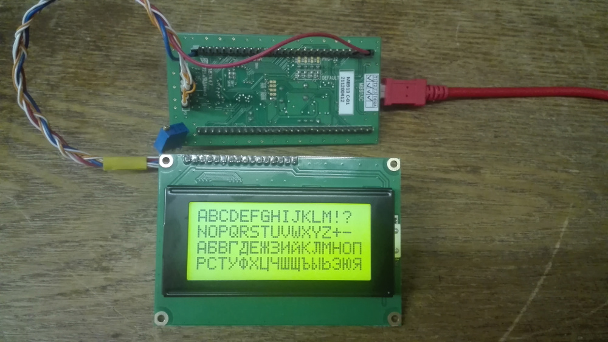

# lcd-wh1602-04-stm32f10x #

<p>This library add support LCD-screens for microcontrollers STM32F10x.</p>
Library lcd-wh1602-04-stm32f10x support Cyrillic letters.

### Tested LCDs ###

* WH1602A (HD44780)
* WH1604A

### Tested STM32 ###

* STM32F100RBT6 (stm32vl-discovery)


### Pins for connect STM32VL-DISCOVERY ###

* RS - PB10
* E -  PB11
* D4 - PB12
* D5 - PB13
* D6 - PB14
* D7 - PB15

### Example code ###
```C
#include "lcd-wh1602-04.h"

char buf[17];


void Delay(volatile uint32_t nCount) {
	for (; nCount != 0; nCount--)
		;
}

int main(void) {

	lcd44780_init_pins();
	lcd44780_init();
	lcd44780_SetLCDPosition(0, 0);
	snprintf(buf, sizeof(buf), "ABCDEFGHIJKLM!?");
	lcd44780_ShowStr(buf);
	lcd44780_SetLCDPosition(0, 1);
	snprintf(buf, sizeof(buf), "NOPQRSTUVWXYZ+-");
	lcd44780_ShowStr(buf);
	lcd44780_SetLCDPosition(0, 2);
	snprintf(buf, sizeof(buf), "АБВГДЕЖЗИЙКЛМНОП");
	lcd44780_ShowStr(buf);
	lcd44780_SetLCDPosition(0, 3);
	snprintf(buf, sizeof(buf), "РСТУФХЦЧШЩЪЫЬЭЮЯ");
	lcd44780_ShowStr(buf);
	while (1) {


	}
}

```


### Contacts ###

ignusius@gmail.com
